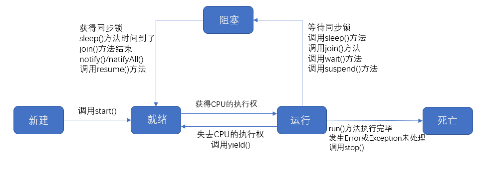

### **JavaSE**

#### 一、Java基础	

##### 1、说一下什么是跨平台？Java为什么可以实现一次编译处处运行？

跨平台指的是软件不因操作系统以及处理器的变化导致无法运行或者运行出错的情况。

Java源代码通过编译产生字节码，然后因为有Java虚拟机(Java Virtual Machine，JVM)，将生成的字节码翻译成虚拟机所在的平台的机器码，并让该平台运行该机器码。

-------

##### 2、说一下JDK、JRE和JVM的区别？JDK、JRE和JVM三者之间的关系，以及JDK、JRE包含的主要结构有哪些？

JDK(Java Development Kit)即**Java开发工具包**，提供了Java开发环境以及Java运行环境。

JRE(Java Runtime Environment)即**Java运行环境**，只提供了Java运行环境。

JVM(Java Virtual Machine)即Java虚拟机，Java虚拟机负责将字节码翻译成虚拟机所在平台的机器码，并让当前平台运行该机器码。

JDK、JRE、JVM三者是包含关系。其中JDK包含了JRE，而JRE包含了JVM。

JDK = JRE + Java的开发工具 （javac.exe、java.exe、javadoc.exe）

JRE = JVM +Java的核心类库

-------------

##### 3、为什么要配置path环境变量？如何配置？

因为配置了path环境变量之后，可以在任意路径下使用javac.exe、java.exe等java命令

JAVA_HOME = bin的上一层目录

path = %JAVA_HOME%\bin

------------

##### 4、使用命令运行类


-----------

##### 5、请说出以下代码的运行结果

```Java
public static int getValue(int i) {  
        int result = 0;  
        switch (i) {  
        case 1:  
            result = result + i;  
        case 2:  
            result = result + i * 2;  
        case 3:  
            result = result + i * 3;  
        }  
        return result;  
    }  
```

答：结果为10，因为case 2后面没有写break跳出switch结构，所以case 2之后的所有case 都会执行。

----

##### 6、Java创建对象有几种方式？

* 使用new关键字创建对象---->调用了构造函数

* 通过Class类中的newInstance()方法创建对象---->调用了构造函数     java/lang/Class

  ```Java
  Student student = Student.class.newInstance();
  System.out.println(student);
  ```

* 通过Constructor类中的newInstance()方法创建对象---->调用了构造函数   java/lang/reflect/Constructor

  ```Java
  Constructor<Student> constructor = Student.class.getConstructor();
  Student student = constructor.newInstance();
  System.out.println(student);
  ```

* 通过clone创建对象---->没有调用构造函数

  无论何时我们调用一个对象的clone方法，jvm就会创建一个新的对象，将前面对象的内容全部拷贝进去。用clone方法创建对象并不会调用任何构造函数 

  Student类要实现Cloenable接口，要不然会报CloneNotSupportedException异常

  ```Java
  Student student2 = (Student) student.clone();
  System.out.println(student2);
  ```

* 使用反序列化创建对象---->没有调用构造函数

  当我们序列化和反序列化一个对象，jvm会给我们创建一个单独的对象。在反序列化时，jvm创建对象并不会调用任何构造函数。
  为了反序列化一个对象，我们需要让我们的类实现Serializable接口 

-------

##### 7、Java的基本数据类型以及对应的包装类

* 整数型：byte(1个字节)、short(2个字节)、int(4个字节)、long(8个字节)

* 浮点型：float(4个字节)、double(8个字节)

* 布尔型：boolean(1个字节)

* 字符型：char(2个字节)

  int对应的包装类型为Integer，char对应的包装类型为Character

----

##### 8、Switch语句里面的条件可不可以是byte、long、String？使用时应该注意什么？

Switch语句里面的条件必须是能隐式转换为int类型的，故long和String不行，byte可以；使用Switch还应该注意case 后面应该带break，要不然执行了一个case之后，后面的所有case都会执行。

--------

#### 二、Java的封装、继承、多态

##### 1、多态是编译时行为还是运行时行为？

Java引用变量有两种类型：**编译时类型**和**运行时类型**。编译时类型由声明该变量时使用的类型决定，运行时类型由实际赋给该变量的对象决定。简称：**编译时，看左边；运行时，看右边。**

1. 若编译时类型和运行时类型不一致，就出现了对象的多态性（Polymorphism）
2. 多态情况下，“看左边”：看的是父类的引用（父类中不具备子类特有的方法）
3. 多态情况下，“看右边”：看的是子类对象（实际运行的是子类重写父类的方法）

- 正常方法调用

  ```Java
  Person e = new Person();
  e.getInfo();
  Student e = new Student();
  e.getInfo();
  ```

- 虚拟方法调用（多态的情况下）

子类中定义了与父类同名同参数的方法，在多态情况下，将此时父类的方法称为虚拟方法，父类根据赋给它的不同子类对象，动态调用属于子类的该方法。这样的方法调用在编译期是无法确定的。

```Java
Person e = new Student();
e.getInfo();	//调用Student类的getInfo()方法
```

- 编译时类型和运行时类型

编译时e为Person类型，而方法的调用是在运行时确定的，所以调用的是Student类的getInfo()方法。这属于晚绑定或动态绑定。

所以多态属于运行时行为。

```Java
import java.util.Random;
//面试题：多态是编译时行为还是运行时行为？
//证明如下：
class Animal  {
	protected void eat() {
		System.out.println("animal eat food");
	}
}

class Cat extends Animal  {
	protected void eat() {
		System.out.println("cat eat fish");
	}
}

class Dog extends Animal  {
	public void eat() {
		System.out.println("Dog eat bone");
	}
}

class Sheep extends Animal  {
	public void eat() {
		System.out.println("Sheep eat grass");
	}
}

public class InterviewTest {
	public static Animal getInstance(int key) {
		switch (key) {
		case 0:
			return new Cat ();
		case 1:
			return new Dog ();
		default:
			return new Sheep ();
		}
	}

	public static void main(String[] args) {
		int key = new Random().nextInt(3);
		System.out.println(key);
		Animal  animal = getInstance(key);
		animal.eat(); 
	}
}
```

------

##### 2、方法重载和重写的区别?

方法重载是指同一个类中方法的名称相同，但参数列表不同的多个方法。

方法重写是指子类继承父类之后，重写继承的方法，重写规则要求方法名称相同， 返回类型与被重写方法的返回类型可以不相同，但是必须是父类返回值的派生类 ，参数列表相同，但方法体不同。方法的重写是多态的一种体现。

重载，是指允许存在多个同名方法，而这些方法的参数不同。编译器根据方法不同的参数列表，对同名方法的名称做修饰。对于编译器而言，这些同名方法就成了不同的方法。它们的调用地址在编译期就绑定了。Java的重载是可以包括父类和子类的，即子类可以重载父类的同名不同参数的方法。

**方法重载不表现为多态，而方法重写表现为多态。**

所以：对于重载而言，在方法调用之前，编译器就已经确定了所要调用的方法，这称为**“早绑定”**或**“静态绑定”**；

而对于多态，只等到方法调用的那一刻，解释运行器才会确定所要调用的具体方法，这称为**“晚绑定”**或**“动态绑定”**。 

引用一句**Bruce Eckel**的话：“**不要犯傻，如果它不是晚绑定，它就不是多态。**”

------

##### 3、该程序的输出结果为？

```Java
//考查多态的笔试题目：	P293
public class InterviewTest1 {
	public static void main(String[] args) {
		Base base = new Sub();
		base.add(1, 2, 3);

		Sub s = (Sub)base;
		s.add(1,2,3);
	}
}

class Base {
	public void add(int a, int... arr) {
		System.out.println("base");
	}
}

class Sub extends Base {
	public void add(int a, int[] arr) {
		System.out.println("sub_1");
	}
	public void add(int a, int b, int c) {
		System.out.println("sub_2");
	}
}
```

sub_1

sub_2

------

##### 4、final、finally、finalize的区别？

* **final：**final可以修饰属性、方法和类

​	1.final修饰属性，该变量为常量

​	2.final修饰方法，该方法不能被重写

​	3.final修饰类，该类不能不继承

* **finally：**用于异常中，不论try cache如何，finally中的代码都会执行， 经常被用在需要释放资源的情况下 
* **finalize：** finalize是Object类的一个方法，在垃圾收集器执行的时候会调用被回收对象的此方法，供垃圾收集时的其他资源回收，例如关闭文件等 

****

##### 5、==和equals()的区别？

**==：**

1. 可以使用在基本数据类型变量和引用数据类型变量中
2. 如果比较的是基本数据类型变量：比较两个变量保存的数据是否相等。（不一定类型要相同）
3. 如果比较的是引用数据类型变量：比较两个对象的地址值是否相同.即两个引用是否指向同一个对象实体
4. 补充： == 符号使用时，必须保证符号左右两边的变量类型一致。

**equals:**

1. equals只适用于引用数据类型
2. Object类中定义的equals()和==的作用是相同的：比较两个对象的地址值是否相同，即两个引用是否指向同一个对象实体。
3. 像String、Date、File、包装类等都重写了Object类中的equals()方法。重写以后，比较的不是两个引用的地址是否相同，而是比较两个对象的“实体内容”是否相同。
4. equals默认比较引用是否相同，但大多数类重写了equals方法。

----

##### 6、以下程序的运行结果为？

```
public void test(){
	Integer i = new Integer(1);
	Integer j = new Integer(1);
	System.out.println(i == j);
	
	//Integer内部定义了IntegerCache结构，IntegerCache中定义了Integer[],
	//保存了从-128~127范围的整数。如果我们使用自动装箱的方式，给Integer赋值的范围在
	//-128~127范围内时，可以直接使用数组中的元素，不用再去new了。目的：提高效率
	Integer m = 1;
	Integer n = 1;
	System.out.println(m == n);
	
	//128不在此范围内，所以 x 和 y相当于new了一个Integer对象
	Integer x = 128;
	Integer y = 128;
	System.out.println(x == y);
}
```

第一小题的结果为false，因为都是new出来的，所以 i 和 j 都是地址值且二者是不一样的，而 == 在比较引用数据类型时，比较的就是地址值。所以为false。

第二小题的结果为true，第三小题的结果为false。

*****

##### 7、以下程序有什么问题，如果有请指出来？

**7.1**

```Java
interface A {
	int x = 0;
}
class B {
	int x = 1;
}
class C extends B implements A {
	public void pX(){
		System.out.println(x);
	}
	public static void main(String[] args){
		new C().pX();
	}
}
```

System.out.println(x);方法编译无法通过。

```Java
//此处编译不通过，因为x是不明确的
//可以通过这样访问
System.out.println(super.x);  //调用父类中的 1
System.out.println(A.x);	//调用接口中的 0
```

**7.2**

```
interface Playable{
	void play();
}
interface Bounceable{
	void play();
}
iterface Rollable extends Playable,Bounceable{
	Ball ball = new Ball("PingPang");
}
class Ball implements Rollable{
	private String name;
	public String getName(){
		return name;
	}
	public Ball(String name){
		this.name = name;
	}
	public void play(){
		ball = new Ball("Football");
		System.out.println(ball.getName());
	}
}
```

1、因为Ball类实现了Rollable接口，而Rollable接口继承了Playable和Bounceable接口，但Playable和Bounceable接口中都有play()方法，所以play其实是重写了两个接口中的play()方法。

2、因为Rollable接口中	Ball	ball = new	Ball("PingPang");    ball  为常量，所以在Ball类中的play()方法重新给ball赋值是错误的。

------

##### 8、请手写一个单例模式

```Java
//饿汉式单例模式
class Singleton{
	//定义私有的构造器
	private singleton(){
	}
	//声明Singleton类的实例instance
	private static Singleton instance = new Singleton();
	//声明静态的getInstance()方法				
	public static Singleton getInstance(){
		return instance;
	}
}

//懒汉式单例模式
class Singleton{
	//定义私有的构造器
    private singleton(){
    }
    //声明静态的实例对象为null
    private static Singleton instance = null;
    //声明静态的获取实例对象的方法
    private static Singleton getInstance(){
        if(null==instance){
            synochized(Singleton.class){
            	if(null==instance){
            		instance = new Singleton();
        		}
        	}
        }
        return instance;
    }
}

懒汉式单例模式：延迟对象的创建，节省内存，调用getInstance()方法时才实例化Singleton类的对象
饿汉式单例模式：对象加载时间过长，线程安全
```

****

##### 9、抽象类和接口有什么相同点和不同点？

**相同点：**①抽象类和接口都不能实例化

​			   ②都可以包含抽象方法

**不同点：**①抽象类是单继承的，而接口是多继承的

​			   ②抽象类中可以声明构造器而接口不能声明构造器

​			   ③抽象类中可以有非抽象方法，而接口中只能有抽象方法、静态方法、默认方法。接口在往类的方向上靠

#### 三、Java异常

------

##### 1、Java常见的异常有哪些，请举例说明？

```
Java.lang.Throwable
		|-----java.lang.Error:一般不编写针对性的代码进行处理
		|-----java.lang.Exception:可以进行异常的处理
			|-----编译时异常(checked)
				|-----IOException(IO异常)
					|-----FileNotFoundException(文件未找到异常)
				|-----ClassNotFoundException(类未发现异常)
			|-----运行时异常(unchecked,RuntimeException)
				|-----NullPointerException(空指针异常)
				|-----ArrayIndexOutOfBoundsException(数组越界异常)
				|-----ClassCastException(类型转换异常)
				|-----NumberFormatException(数值转换异常)
				|-----InputMisMatchException(Scanner输入类型不正常)
				|-----ArithmeticException(算数运算异常)
```

****

##### throw和throws的区别？

throw表示抛出一个异常类的对象，生成异常对象的过程，在方法内进行声明

throws是异常处理的一种方式，在方法上进行声明

****


#### 三、Java常用实用类

------

##### 1、以下程序输出的结果

**例一：**

```Java
pub void test(){
	String s1 = "javaEEhadoop";
	String s2 = "javaEE"；
	String s3 = s2 + "hadoop";
	System.out.println(s1==s3);
	
	final String s4 = "javaEE";
	String s5 = s4 + "hadoop";
	System.out.println(s1==s5);
}
```

false

true

结论：①常量与常量的拼接结果在常量池。且常量池不会存在相同内容的常量

​			②只要其中有一个是变量，结果就在堆中

​			③如果拼接的结果调用intern()方法，返回值就在常量池中


#### 四、Java集合

------

##### 以下程序的输出结果为？

**例一：**

```
public void test(){
	String[] arr = new String[]{"MM","MM","MM"};
	for(String s: arr){
		s="GG";
	}
	for(String s: arr){
		System.out.println(s);
	}
}
```

MM

MM

MM

因为增强for循环的底层还是使用迭代器进行处理的，将arr中的一个值赋给新的变量s，是不会影响原来的arr的

****

**例二：**

```
HashSet set = new HashSet(); 
Person p1 = new Person(1001,"AA"); 
Person p2 = new Person(1002,"BB");
set.add(p1); 
set.add(p2);
p1.name = "CC";
set.remove(p1);
System.out.println(set);
set.add(new Person(1001,"CC"));
System.out.println(set);
set.add(new Person(1001,"AA"));
System.out.println(set);
其中Person类中重写了hashCode()和equal()方法

```


#### 五、Java输入输出流

------


#### 六、Java多线程

------

##### 请简述程序、进程和线程的概念？

程序：即为完成特定任务、使用某种语言编写的一组指令的集合，是**一段静态代码**。

进程：程序的一次执行过程，或是**正在运行的一个程序**，进程是计算机分配资源的最基本的单位。

线程：进程可进一步细化为线程，是一个程序内部的一条执行路径。

------

##### Java创建多线程有几种方式？

Java创建多线程有4种方式，分别是**继承Thread类**、**实现Runnable接口**、**实现Callable接口**、**使用线程池**。

------

##### Java是如何解决线程安全问题的，有几种方式？并对比几种方式的不同？

Java有3种方式解决线程安全问题，分别是使用Lock锁、使用同步代码块、使用同步方法。

使用的优先顺序为：Lock--->同步代码块(已经进入了方法体，分配了相应资源)--->同步方法(在方法体之外)

------

##### synchronized和lock的区别？

**相同点：**synchronized和lock都可以解决线程安全问题

**不同点：**synchronized机制在执行完相应的同步代码以后，自动的释放同步监视器，而lock需要手动的启动同步（lock()），同时结束同步也需要手动实现（unlock()）。

------

##### sleep()和wait()的区别？

**相同点：**都可以使当前线程进入阻塞状态

**不同点：**

1、sleep()和wait()方法的位置不同，sleep()属于Thread()类中的静态方法，而wait()属于Object()类中方法。

2、sleep()和wait()调用的场景不同，sleep()可以在任意场景中进行使用，而wait()则只能在同步代码块或同步方法中调用。

3、sleep()和wait()都在同步代码块或同步方法中调用，sleep()不会释放同步锁，而wait()会释放同步锁。

------

##### 请说一下线程的生命周期？



------

##### 通过Runnable接口和Callable接口创建多线程有什么区别？

①通过Callable接口创建的多线程**重写的call()方法**可以有返回值

②通过Callable接口创建的多线程**重写的call()方法可以抛出异常**，被外面的操作捕获，获取异常信息。

③通过Callable接口创建的多线程支持泛型

*****

##### 使用线程池有什么好处？

①使用线程池可以提高系统的响应速度（减少了创建新线程的时间）

②使用线程池可以节约系统资源（重复利用线程池中的线程，不需要每次都创建）

③便于线程的管理（corePoolSize:核心池的大小）


#### 七、Java网络编程

#### 八、Java反射

##### 1、描述一下JVM加载class文件的原理机制？

> JVM中类的装载是由ClassLoader和它的子类来实现的，Java ClassLoader是一个重要的Java运行时系统组件。它负责在运行时查找和装入类文件的类。
>


#### 九、Java JDBC操作数据库

##### 1、请写出JDBC连接数据库的步骤?

```Java

```


### JavaWeb

##### 5、说一下get和post的区别？

HTTP各状态码的含义： https://www.jianshu.com/p/760b1b579b0f 

1、get方式的请求会发一个数据包，其中包括header和data,而post方式的请求则发两个数据包，第一个数据包是header,当服务器响应了第一个header后，才会发第二个数据包中的data。（**注：**因为和有的浏览器以及框架的post请求也只发送一个数据包，所以这种说法并不准确。例如，FireFox发送Post请求就只发送一个数据包。）

2、get方式的请求并不安全（参数直接暴露在URL地址栏中），且参数的长度有限制（URL最长为2048个字符），post方式的请求安全。

3、get方式通过URL传递参数，而post则通过request body传递参数。

4、浏览器回退或刷新时，get方式的请求是无害的，而post方式的请求则会重新提交数据。

5、get方式能被缓存，而post方式不能被缓存。

6、get方式的请求对数据类型限制为ASCII字符，而post方式的请求没有限制。

### 数据库方面

#### 一、MySQL

##### 说一下什么是事务以及事务的四大特性和事务的隔离级别？

事务的概念：事务是指如果一个包含多个步骤的业务操作被事务管理，要么这些操作同时成功，要么这些操作同时失败。

1、原子性（Atomicity）:事务中的各项操作要么全部都做，要么全部不做。

2、一致性（Consistent）:数据操作前后数据的总量保持不变。

3、隔离性（Isolation）:一个事务的执行不能被其他事务干扰，各个事务之间相互独立。

4、持久性（Durability）:当数据被提交或回滚之后，数据库会持久化保存数据。

------

事务隔离级别的概念：多个事务之间是隔离的且相互独立的。但是如果多个事务操作同一批数据，则会引发一些问题，而设置事务的隔离级别则可用解决这些问题。

这篇博客解释事务的隔离非常不错： https://www.cnblogs.com/ubuntu1/p/8999403.html 

存在的问题：

1、脏读：一个事务，读取到另一个事务中没有提交的数据。

2、不可重复读（虚读）：在同一个事务中两次读取到的数据不一样。

3、幻读：指一个事务查询两次，第二次查询出了第一次未查询出的结果。

隔离级别：

1、read uncommitted:读未提交

​	   产生的问题：脏读、不可重复读、幻读

2、read committed:读已提交（Oracle默认的隔离级别）

​	   产生的问题：不可重复读、幻读

3、repeatable read:可重复读（MySQL的默认隔离级别）

​	   产生的问题：幻读

4、serializable:串行化

​	   可以解决所有问题

隔离级别从小到大安全性越来越高，但是效率越来越低。

### 框架

#### 一、Spring

##### Spring中bean的默认作用范围？

默认为singleton单例的

#### 二、Spring MVC

#### 三、Mybatis

#### 四、Spring Boot


### 设计模式

设计模式是**在大量的实践中总结和理论化之后优化的代码结构、编程风格以及解决问题的思考方式**。

#### 一、 单例设计模式

1、要解决的问题：所谓类的单例设计模式，就是采取一定的方法保证在整个软件系统中，**对某个类只能存在一个对象实例**。

2、具体的代码实现：

```Java
饿汉式单例模式：
class Singleton{
	//1.将构造器私有化
	private Singleton(){
	}
    //2.内部创建类的对象
	//4.要求此对象也必须声明为静态的
	private static Singleton instance = new Singleton();
	//3.提供公共的静态的方法，返回类的对象
	public Singleton getInstance(){
		return instance;
	}
}

懒汉式单例模式：
class Singleton{
    //将构造器私有化
    private Singleton(){
    }
    //声明静态的Singleton实例
    private static Singleton instance = null;
    //声明静态的获取实例的方法
    public static getInstance(){
       if(null==instance){
            synochrized(Singleton.class){
            	if(null == instance){
            		instance = new Singleton();
        		}
        	}
        }
        return instance;
    }
}

饿汉式单例模式：线程安全，但加载类的同时声明了类的实例，对象加载时间过长。
懒汉式单例模式：延迟了对象的创建，节约内存。
```

#### 二、工厂模式

工厂模式：实现了**创建者和调用者的分离**，即将创建对象的具体过程屏蔽隔离起来，达到提高灵活性的目的。


